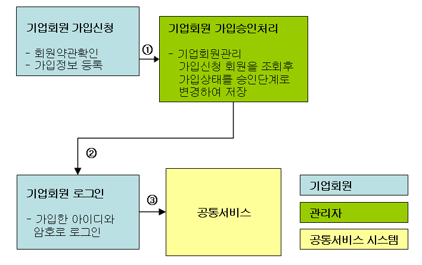
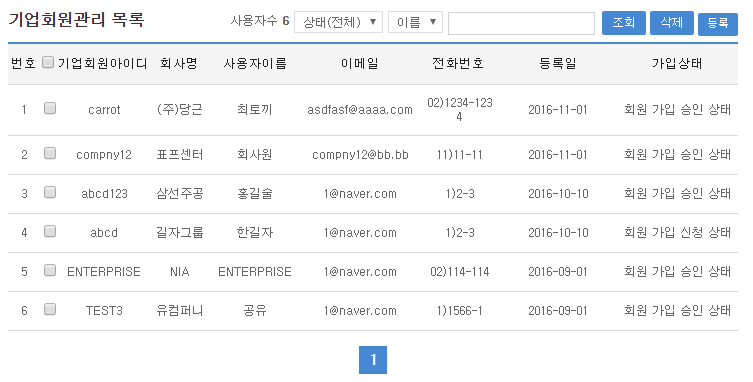
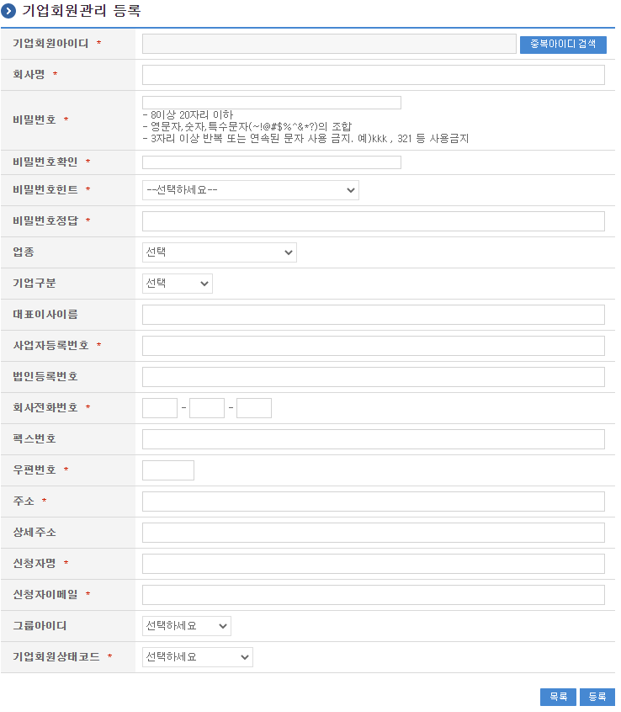
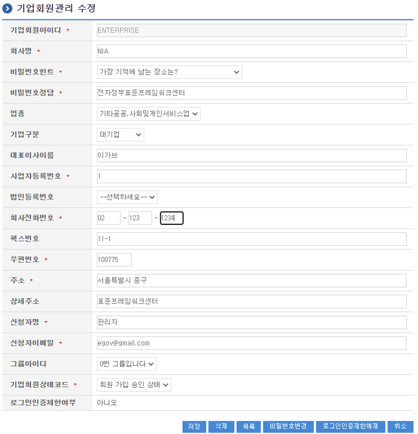
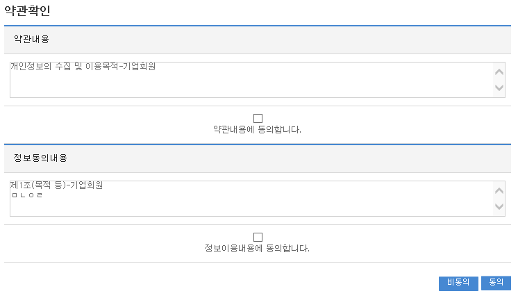
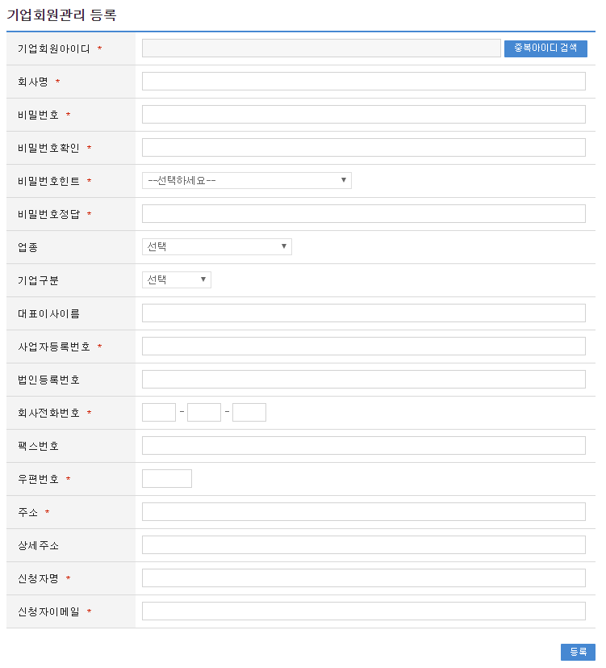

# 기업 회원 관리

## 개요

기업회원관리는 회원목록 조회기능과 신규등록기능, 상세조회기능, 회원정보수정기능, 회원암호수정기능, 회원정보삭제기능, 가입신청기능을 제공한다.

**기능흐름**

| 기능명 | 기능 흐름 |
|---|---|
| 기업회원 등록 및 시스템 사용 | ①기업회원가입신청 → ②관리자에 의한 가입승인 → ③기업회원 아이디를 통한 시스템 로그인 |



## 설명

### 패키지 참조 관계

사용자, 기업회원, 회원 패키지는 요소기술의 공통 패키지(cmm)와 직접적인 함수적 참조 관계를 가진다.

- 패키지 간 참조 관계 : [사용자지원 Package Dependency](https://www.egovframe.go.kr/wiki/doku.php?id=egovframework%3Acom%3Av2%3Ainit_pkg_dependency)

### 관련소스

| 유형 | 대상소스명 | 비고 |
|---|---|---|
| Controller | egovframework.com.uss.umt.web.EgovEntrprsManageController.java | 기업회원 관리를 위한 컨트롤러 클래스 |
| Service | egovframework.com.uss.umt.service.EgovEntrprsManageService.java | 기업회원 관리를 위한 서비스 인터페이스 |
| ServiceImpl | egovframework.com.uss.umt.service.impl.EgovEntrprsManageServiceImpl.java | 기업회원 관리를 위한 서비스 구현 클래스 |
| VO | egovframework.com.uss.umt.service.EntrprsManageVO.java | 기업회원 관리를 위한 모델 클래스 |
| VO | egovframework.com.uss.umt.service.UserDefaultVO.java | 기업회원 관리를 위한 검색조건용 VO 클래스 |
| DAO | egovframework.com.uss.umt.service.impl.EntrprsManageDAO.java | 기업회원 관리를 위한 데이터처리 클래스 |
| JSP | /WEB-INF/jsp/egovframework/com/uss/umt/EgovEntrprsMberInsert.jsp | 기업회원 등록을 위한 jsp페이지 |
| JSP | /WEB-INF/jsp/egovframework/com/uss/umt/EgovEntrprsMberSelectUpdt.jsp | 기업회원 상세조회 및 수정을 위한 jsp페이지 |
| JSP | /WEB-INF/jsp/egovframework/com/uss/umt/EgovEntrprsPasswordUpdt.jsp | 기업회원 암호수정을 위한 jsp페이지 |
| JSP | /WEB-INF/jsp/egovframework/com/uss/umt/EgovEntrprsMberManage.jsp | 기업회원 목록조회를 위한 jsp페이지 |
| JSP | /WEB-INF/jsp/egovframework/com/uss/umt/EgovIdDplctCnfirm.jsp | 중복아이디 확인을 위한 jsp페이지 |
| JSP | /WEB-INF/jsp/egovframework/com/uss/umt/EgovEntrprsMberSbscrb.jsp | 기업회원 가입신청을 위한 jsp페이지 |
| Query XML | resources/egovframework/mapper/com/uss/umt/EgovEntrprsManage_SQL_altibase.xml | Altibase용 Query XML |
| Query XML | resources/egovframework/mapper/com/uss/umt/EgovEntrprsManage_SQL_cubrid.xml | Cubrid용 Query XML |
| Query XML | resources/egovframework/mapper/com/uss/umt/EgovEntrprsManage_SQL_maria.xml | MariaDB용 Query XML |
| Query XML | resources/egovframework/mapper/com/uss/umt/EgovEntrprsManage_SQL_mysql.xml | MySQL용 Query XML |
| Query XML | resources/egovframework/mapper/com/uss/umt/EgovEntrprsManage_SQL_oracle.xml | Oracle용 Query XML |
| Query XML | resources/egovframework/mapper/com/uss/umt/EgovEntrprsManage_SQL_postgres.xml | PostgreSQL용 Query XML |
| Query XML | resources/egovframework/mapper/com/uss/umt/EgovEntrprsManage_SQL_tibero.xml | Tibero용 Query XML |
| Query XML | resources/egovframework/mapper/com/uss/umt/EgovEntrprsManage_SQL_goldilocks.xml | Goldilocks용 Query XML |
| Validator XML | resources/egovframework/validator/com/uss/umt/EgovEntrprsManage.xml | validator 룰 설정파일 |
| Idgen XML | resources/egovframework/spring/com/idgn/context-idgn-UsrCnfrm.xml | 기업회원 관리 Id생성 Idgen XML |
| Message properties | resources/egovframework/message/com/uss/umt/message_ko.properties | 한글 메시지 |
| Message properties | resources/egovframework/message/com/uss/umt/message_en.properties | 영문 메시지 |

### 클래스 다이어그램


### ID Generation

#### ID Generation 관련 DDL 및 DML

ID Generation Service를 활용하기 위해서 Sequence 저장테이블인 `COMTECOPSEQ`에 `USRCNFRM_ID` 항목을 추가해야 한다.  
본 시스템의 기능 중에서 회원, 사용자관리에서도 `USRCNFRM_ID` 항목을 사용하여 고유아이디를 생성한다.

```sql
CREATE TABLE COMTECOPSEQ (
  TABLE_NAME VARCHAR(20) NOT NULL,
  NEXT_ID NUMERIC(30) NULL,
  PRIMARY KEY (TABLE_NAME)
);

INSERT INTO COMTECOPSEQ VALUES('SCHDUL_ID','1');
```

#### ID Generation 환경설정(context-idgn-UsrCnfrm.xml)

```xml
<bean name="egovUsrCnfrmIdGnrService"
      class="egovframework.rte.fdl.idgnr.impl.EgovTableIdGnrServiceImpl"
      destroy-method="destroy">
  <property name="dataSource" ref="egov.dataSource" />
  <property name="strategy" ref="usrCnfrmStrategy" />
  <property name="blockSize" value="10"/>
  <property name="table" value="COMTECOPSEQ"/>
  <property name="tableName" value="USRCNFRM_ID"/>
</bean>

<bean name="usrCnfrmStrategy"
      class="egovframework.rte.fdl.idgnr.impl.strategy.EgovIdGnrStrategyImpl">
  <property name="prefix" value="USRCNFRM_" />
  <property name="cipers" value="11" />
  <property name="fillChar" value="0" />
</bean>
```

### 관련테이블

| 테이블명 | 테이블명(영문) | 비고 |
|---|---|---|
| 기업회원정보 | COMTNENTRPRSMBER | 기업회원 정보를 관리한다. |

### 관련코드

기업회원관리에서 사용되는 코드 및 그에 따른 설정 값의 반영사항은 다음과 같다.

| 코드분류 | 코드분류명 | 코드ID / 테이블 | 코드명 | 설정반영사항 |
|---|---|---|---|---|
| COM012 | 사용자유형 | USR01 | 일반회원 | 일반회원 유형 |
|  |  | USR02 | 기업회원 | 기업회원 유형 |
|  |  | USR03 | 업무사용자 | 업무사용자 유형 |
| COM013 | 사용자상태 | A | 가입신청 | 회원가입신청상태 |
|  |  | P | 가입승인 | 회원가입승인상태 |
|  |  | D | 가입삭제 | 회원가입삭제상태 |
| COM014 | 성별구분 | F | 여자 | 여자 |
|  |  | M | 남자 | 남자 |
| COM022 | 패스워드힌트 | 동적으로생성함 | 힌트 | 패스워드힌트 |
| COM026 | 기업구분코드 | 동적으로생성함 | 기업구분 | 기업구분정보 |
| COM027 | 업종구분코드 | 동적으로생성함 | 업종구분 | 업종구분정보 |
| 우편번호코드 |  | COMTCZIP |  | 테이블에 등록된 우편번호정보 |
| 권한그룹코드 |  | COMTNAUTHORGROUPINFO |  | 테이블에 동적으로 생성된 권한그룹레코드정보 |

## 관련기능

기업회원관리는 크게 기업회원 목록조회, 기업회원 등록, 기업회원 상세조회(수정), 기업회원 암호변경, 기업회원 약관확인, 기업회원 가입신청 기능으로 분류된다.

### 기업회원 목록조회

#### 비즈니스 규칙

검색조건은 기업회원상태조건, 기업회원아이디, 기업회원명에 대해서 수행된다.  
검색조건으로 기업회원아이디를 사용하는 경우는 **EQUAL** 검색(동일한 아이디인 경우), 기업회원명을 사용하는 경우는 **LIKE**(근접한 회원명) 검색을 수행한다.

#### 관련코드

N/A

#### 관련화면 및 수행 매뉴얼

| Action | URL | Controller method | SQL Namespace | SQL QueryID |
|---|---|---|---|---|
| 목록조회 | /uss/umt/EgovEntrprsMberManage.do | selectEntrprsMberList | “entrprsManageDAO” | “selectEntrprsMberList” |
|  |  |  | “entrprsManageDAO” | “selectEntrprsMberListTotCnt” |
| 삭제 | /uss/umt/EgovEntrprsMberDelete.do | deleteEntrprsMber | “entrprsManageDAO” | “deleteEntrprs_S” |

- 기업회원 목록은 페이지 당 10건씩 조회되며 페이징은 10페이지씩 이루어진다.  
- 페이지 당 검색 범위를 변경하고자 하는 경우 `context-properties.xml` 파일의 `pageUnit`, `pageSize`를 변경한다(전체 공통서비스 기능에 영향).



- 조회 : 검색조건 설정 후 **검색** 버튼.  
- 삭제 : 상태정보를 **가입승인탈퇴**로 변경하여 처리. 완전삭제는 체크 후 **삭제** 버튼(선행 삭제 필요).  
- 등록 : **등록** 버튼으로 등록 화면 이동.  
- 상세조회(수정) : 아이디 클릭으로 상세조회(수정) 화면 이동.

### 기업회원 등록

#### 비즈니스 규칙

기업회원 정보를 입력하여 신규등록한다. 등록이 성공적으로 종료되면 기업회원 목록조회 화면으로 이동한다.

#### 관련코드

N/A

#### 관련화면 및 수행 매뉴얼

| Action | URL | Controller method | SQL Namespace | SQL QueryID |
|---|---|---|---|---|
| 등록화면 | /uss/umt/EgovEntrprsMberInsertView.do | insertEntrprsMberView |  |  |
| 등록 | /uss/umt/EgovEntrprsMberInsert.do | insertEntrprsMber | “entrprsManageDAO” | “insertEntrprs_S” |



- **목록** : 목록조회 화면으로 이동.  
- **등록** : 필수항목(*) 입력 후 저장. 아이디는 팝업 선택.

### 기업회원 상세조회(수정)

#### 비즈니스 규칙

기업회원 목록의 상세조회 및 수정 기능 제공.

#### 관련코드

N/A

#### 관련화면 및 수행 매뉴얼

| Action | URL | Controller method | SQL Namespace | SQL QueryID |
|---|---|---|---|---|
| 상세조회 | /uss/umt/EgovEntrprsMberSelectUpdtView.do | updateEntrprsMberView | “entrprsManageDAO” | “selectEntrprs_S” |
| 수정 | /uss/umt/EgovEntrprsMberSelectUpdt.do | updateEntrprsMber | “entrprsManageDAO” | “updateEntrprs_S” |
| 삭제 | /uss/umt/EgovEntrprsMberDelete.do | deleteEntrprsMber | “entrprsManageDAO” | “deleteEntrprs_S” |



- **저장** : 수정 후 저장. 필수항목(*) 충족, 아이디 변경 불가. 주소는 팝업 선택.  
- **삭제** : 상태정보를 **가입승인탈퇴**로 변경하여 처리. 완전삭제 시 버튼 사용(선행 삭제 필요).  
- **목록** : 목록조회 화면 이동.  
- **비밀번호변경** : 암호변경 화면으로 이동.  
- **취소** : 입력 초기화.  
- **로그인인증제한해제** : 인증 제한 해제.

### 기업회원 비밀번호변경

#### 비즈니스 규칙

기업회원의 비밀번호를 수정한다. 성공 시 결과 메시지 출력.

#### 관련코드

N/A

#### 관련화면 및 수행 매뉴얼

| Action | URL | Controller method | SQL Namespace | SQL QueryID |
|---|---|---|---|---|
| 비밀번호수정화면 | /uss/umt/EgovEntrprsPasswordUpdtView.do | updatePasswordView |  |  |
| 비밀번호수정 | /uss/umt/EgovEntrprsPasswordUpdt.do | updatePassword | “entrprsManageDAO” | “updatePassword_S”, “selectPassword_S” |


- **수정** : 기존 비밀번호/새 비밀번호/확인 입력 후 저장(기존 비밀번호 불일치 시 실패).  
- **목록** : 목록조회 화면 이동.  
- **취소** : 입력 초기화.

### 기업회원 약관확인

#### 비즈니스 규칙

로그인 화면에서 **가입신청** 버튼 클릭 시 약관 동의 후 진행하도록 하기 위한 화면.  
동의 버튼 클릭 시 DB 작업 없이 **기업회원 등록 화면**으로 이동. 로그인에서 기업회원 선택 후 약관 확인 → 가입신청 화면으로 연결.

#### 관련코드

N/A

#### 관련화면 및 수행 매뉴얼

| Action | URL | Controller method | SQL Namespace | SQL QueryID |
|---|---|---|---|---|
| 동의 | /uss/umt/EgovStplatCnfirmEntrprs.do | sbscrbEntrprsMber | “entrprsManageDAO” | “selectStplat_S” |



- **비동의** : 가입 불가 메시지.  
- **동의** : 기업회원관리 등록화면으로 이동.

### 기업회원 가입신청

#### 비즈니스 규칙

기업회원 정보를 입력하여 신규 가입신청한다. 성공 시 사용자 로그인화면으로 이동.

#### 관련코드

N/A

#### 관련화면 및 수행 매뉴얼
| Action | URL | Controller method | SQL Namespace | SQL QueryID |
|---|---|---|---|---|
| 가입신청화면 | /uss/umt/EgovEntrprsMberSbscrbView.do | sbscrbEntrprsMberView |  |  |
| 가입신청 | /uss/umt/EgovEntrprsMberSbscrb.do | sbscrbEntrprsMber | “entrprsManageDAO” | “insertEntrprs_S” |



- **등록** : 가입신청 기업회원 정보를 입력한후 하단의 등록버튼을 통해서 Database상에 가입신청 기업회원 정보를 저장한다. 입력항목 중에서 필수항목(*표시)은 모두 입력해야 하며 기업회원 아이디는 팝업화면을 호출하여 선택한다.