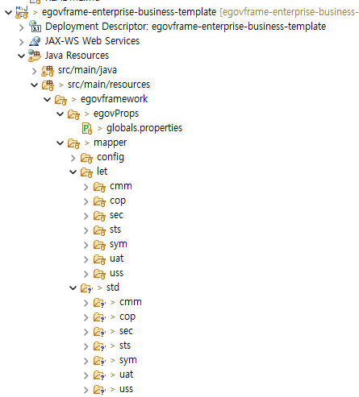

# SQL DB 다중 접속 가이드

## 개요

본 가이드는 여러개의 DB 접속하여 쿼리를 분리하여 사용할때 접속 방법을 가이드한다.

아래의 순서로 SQL 예시와 해당 규칙을 설명하는 방식으로 진행된다.
1. SQL DB 다중 접속 개요
2. globals.properties 설정
3. context-datasource.xml 설정
4. context-mapper.xml 설정
5. mapper SQL 폴더 구조
6. DAO 호출 분기 방법
7. 그외 설정 파일
8. 기타
<br>

## SQL DB 다중 접속 개요
프로젝트에서 여러개의 DB를 접속하여 데이터를 관리해야 하거나 데이터 조회가 필요할 때 설정파일에 정보를 추가하여 mapper 폴더 밑에 프로젝트명으로 폴더를 구분하여 SQL을 선택적으로 사용 할 수 있다. 
<br>
<br>
예시 1. 업무시스템에서 통계시스템 DB의 데이터를 API가 아닌 DB에서 직접 조회를 할 때
<br>
예시 2. 신규 업무시스템에서 로그인시 정보가 없을 때 레거시 시스템 DB의 정보를 복사해야 
할 때
<br>
예시 3. 통합시스템에서 여러개의 분할 된 DB를 통합해서 관리해야 할 때
<br>

## globals.properties 설정 (예시)
```xml
Globals.DbType = mysql
Globals.UserName = ID
Globals.Password = PASSWORD

Globals.DbType2 = postgres
Globals.UserName2 = ID
Globals.Password2 = PASSWORD

#mysql
Globals.DriverClassName = net.sf.log4jdbc.DriverSpy
Globals.Url = jdbc:log4jdbc:mysql://127.0.0.1:3306/ebt

#postgres2
Globals.DriverClassName2=org.postgresql.Driver
Globals.Url2=jdbc:postgresql://127.0.0.1:5432/postgres?currentSchema=ebt
```
<br>

## context-datasource.xml 설정 (예시)
```xml
<!-- datasource 설정(propertyConfigurer 활용) -->
<alias name="dataSource-${Globals.DbType}" alias="dataSource" />
<alias name="dataSource-${Globals.DbType}" alias="egov.dataSource" />
   
<!-- datasource 설정(propertyConfigurer 활용) -->
<alias name="dataSource-${Globals.DbType2}" alias="dataSource2" />
<alias name="dataSource-${Globals.DbType2}" alias="egov.dataSource2" />

<!-- mysql -->
<bean id="dataSource-mysql" class="org.apache.commons.dbcp2.BasicDataSource" destroy-method="close">
    <property name="driverClassName" value="${Globals.DriverClassName}"/>
    <property name="url" value="${Globals.Url}" />
    <property name="username" value="${Globals.UserName}"/>
    <property name="password" value="${Globals.Password}"/>
</bean>

<!-- postgres2 -->
<bean id="dataSource-postgres" class="org.apache.commons.dbcp2.BasicDataSource" destroy-method="close">
    <property name="driverClassName" value="${Globals.DriverClassName2}"/>
    <property name="url" value="${Globals.Url2}" />
    <property name="username" value="${Globals.UserName2}"/>
    <property name="password" value="${Globals.Password2}"/>
</bean>
```
<br>

## context-mapper.xml 설정 (예시)
```xml
<!-- Mybatis setup for Mybatis Database Layer -->
	<bean id="sqlSession" class="org.mybatis.spring.SqlSessionFactoryBean">		
		<property name="dataSource" ref="dataSource"/>
		<property name="configLocation" value="classpath:/egovframework/mapper/config/mapper-config.xml" />
		
		<property name="mapperLocations">
			<list>
				<value>classpath:/egovframework/mapper/let/**/*_${Globals.DbType}.xml</value>
			</list>
		</property>
	</bean>

	<!-- Mybatis Session Template -->
	<bean id="egov.sqlSessionTemplate" class="org.mybatis.spring.SqlSessionTemplate">
		<constructor-arg ref="egov.sqlSession"/>
	</bean>
	
	<alias name="sqlSession" alias="egov.sqlSession" />
	
	<!-- Mybatis setup for Mybatis Database Layer (다중 접속 설정) -->
	<bean id="sqlSessionFactory2" class="org.mybatis.spring.SqlSessionFactoryBean">
	    <property name="dataSource" ref="dataSource-${Globals.DbType2}" />
	    <property name="configLocation" value="classpath:/egovframework/mapper/config/mapper-config.xml" />
	    
	    <property name="mapperLocations">
	        <list>
	            <value>classpath:/egovframework/mapper/std/**/*_${Globals.DbType2}.xml</value>
	        </list>
	    </property>
	</bean>
	
	<!-- Mybatis Session Template2 (다중 접속 설정) -->
	<bean id="egov.sqlSessionTemplate2" class="org.mybatis.spring.SqlSessionTemplate">
	    <constructor-arg ref="sqlSessionFactory2" />
	</bean>
	
	<!-- <alias name="sqlSession2" alias="egov.sqlSession2" />  -->
```

## mapper SQL 폴더 구조
mapper 폴더 밑에 프로젝트를 각각 위치한다.


## DAO 호출 분기 방법
LoginDAO2.java
```xml
@Repository("loginDAO2")
public class LoginDAO2 extends EgovAbstractMapper {
	@Resource(name = "egov.sqlSessionTemplate2")
    private SqlSession sqlSessionTemplate2;
    
    /**
	 * nmcb 일반 로그인을 처리한다
	 * @param vo LoginVO
	 * @return LoginVO
	 * @exception Exception
	 */
    public LoginVO nmcbLogin(LoginVO vo) throws Exception {
    	return (LoginVO)sqlSessionTemplate2.selectOne("loginDAO2.nmcbLogin", vo);
    }

}
```

```sql
<mapper namespace="loginDAO2">

<!-- 일반 로그인 -->
	<select id="loginDAO2.nmcbLogin" resultMap="login">
    쿼리문
  </select>
```

## 그외 설정 파일
dataSource로 검색하면 나오는 파일들을 확인해야 한다. 용도에 맞게 설정을 추가해야 한다.
<br>
```xml
context-idgen.xml
context-transaction.xml
context-security.xml
```

## 기타
본 가이드의 잘못된 부분이나 부족한 부분의 정보를 아시는 분이라면 누구라도 업데이트 하셔도 됩니다.